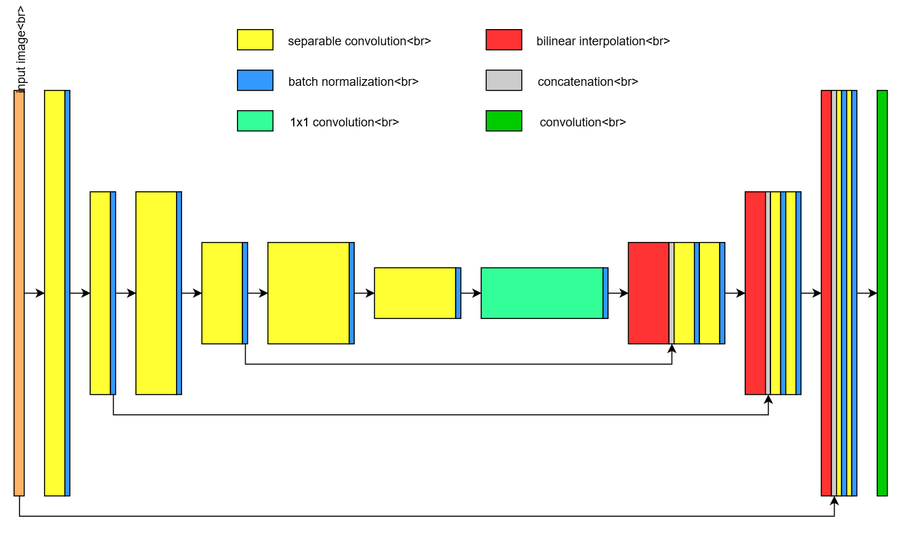
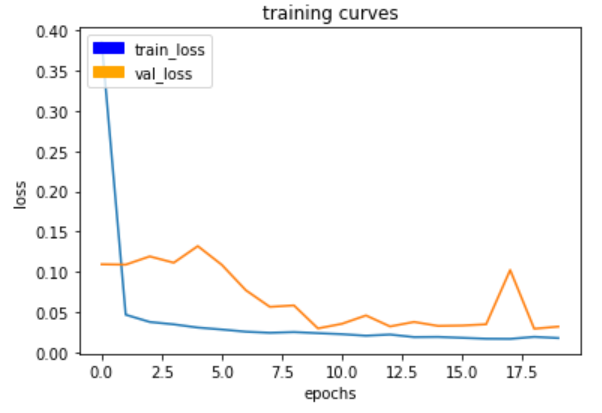
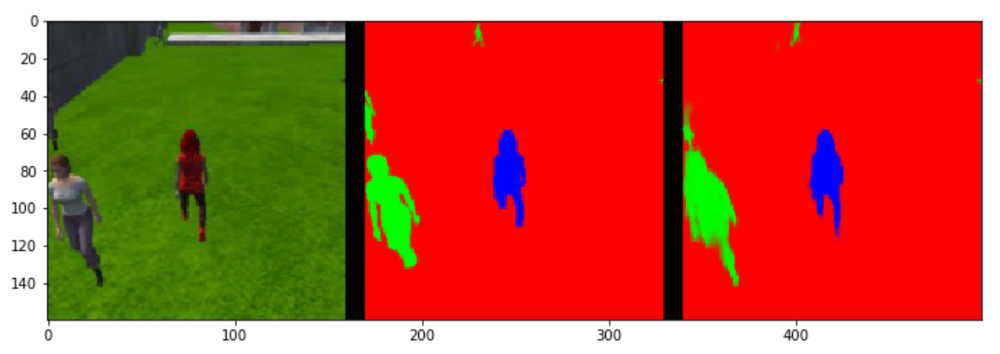

# Udacity_RoboND_Follow_Me
*In this project, A quadrotor can identify a female target hero from the crowd and follow her. The identification task is achieved by semantic segmentation in fully convolutional networks (FCN). Moreover, the quadrotor is controlled by PID that will be also discussed in this `README.md`.*

**Python with TensorFlow and Keras** are used for implementing this project and **Unity** is used for simulating the environment.

This is a `README` that includes all the key points and how I addressed each one.

**Steps to complete the project:**  

1. Clone the project repo [here](https://github.com/udacity/RoboND-DeepLearning-Project.git).
2. Fill out the TODO's in the project code.
3. Optimize your network and hyper-parameters.
4. Train your network and achieve an accuracy of 40% (0.40) using the Intersection over Union IoU metric which is final_grade_score at the bottom of your notebook.

## 1. Network Architecture

The final version network architecture of the fully convolutional networks (FCN) in this project is shown below:

To begin with, after the input is the six separable convolution layers that extract features from an input image, each followed by a batch normalization. The reason to choose the separate convolutional layer instead of a normal convolutional layer is that the separate convolutional layer can reduce the number of parameters needed, thus increasing efficiency for the encoder network. 

The followed batch normalization is based on the idea that, instead of just normalizing the inputs to the network, we normalize the inputs to layers within the network. It's called "batch" normalization because, during training, we normalize each layer's inputs by using the mean and variance of the values in the current mini-batch. It has the advantages that: 1. Networks train faster; 2. Allows higher learning rates; 3. Simplifies the creation of deeper networks and 4. Provides a bit of regularization.

After the encoder section (six separable convolution layers) is the 1\*1 convolution. We can't use fully connected layers here because we need to preserve spatial information (every pixel in an image have to be classified).

Next is the decoder section where the feature maps are upsample using bilinear interpolation three times. Skip connection via concatenation after upsampling allows to use of data from the input high-resolution image. Two additional separable convolution layers are applied after concatenation and introduce nonlinearity by ReLu built-inside. After every separable convolution, batch normalization is also applied to provide better convergence and normalization. 

In the end, the final convolution provides classification probabilities for every pixel for semantic segmentation.

## 2. Neural network's hyperparameters

There are several important neural network's hyperparameters we need to tune to achieve the best result. For example, the epoch (the number of iterations until the network stops learning or start overfitting), the learning rate and batch size (number of training samples/images that get propagated through the network in a single pass).

As in most popular FCN designs, hyperparameters should be limited to learning rate = [0.001, 0.3], batch = [32, 64] and filter number = [32, 1024] for further investigation.

And after several trial and test, the learning rate is set to 0.005, the epoch is set to 20 and the batch size is set to 64.

## 3. Result

Below is the learning curve after 20 epochs, the loss curve is dropping continuously without divergence. 

The corresponding semantic segmentation for the scenarios like following the target, patroling with target and patroling without a target is shown below:

The final score for this FCN is 0.459662052405 that passes the requirement 0.40.

## 4. Future Enhancements
Although the project is finished, there are still some ways that may lead to future enhancements:
1. Collect more data for training.
2. Neural network's hyperparameters may be further tuned for better performance, instead of manually tuning, automatic hyperparameter tuning like Bayesian optimization may be applied in the future.
3. More combinations of encoder and decoder should be tried and come up with a more ideal model.
